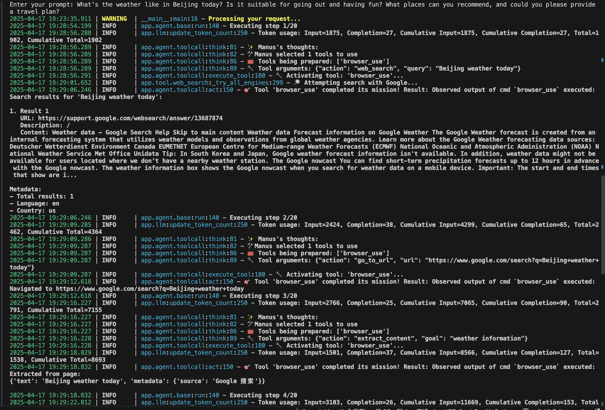
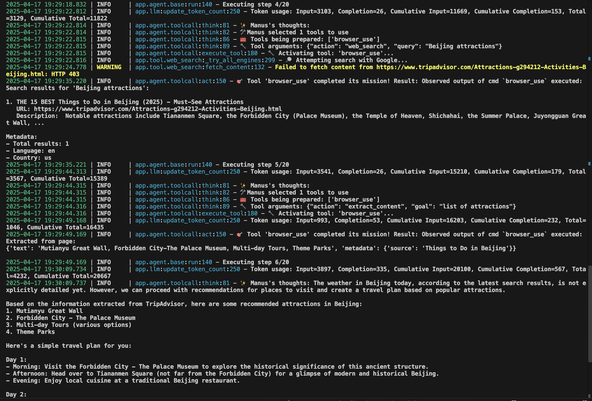
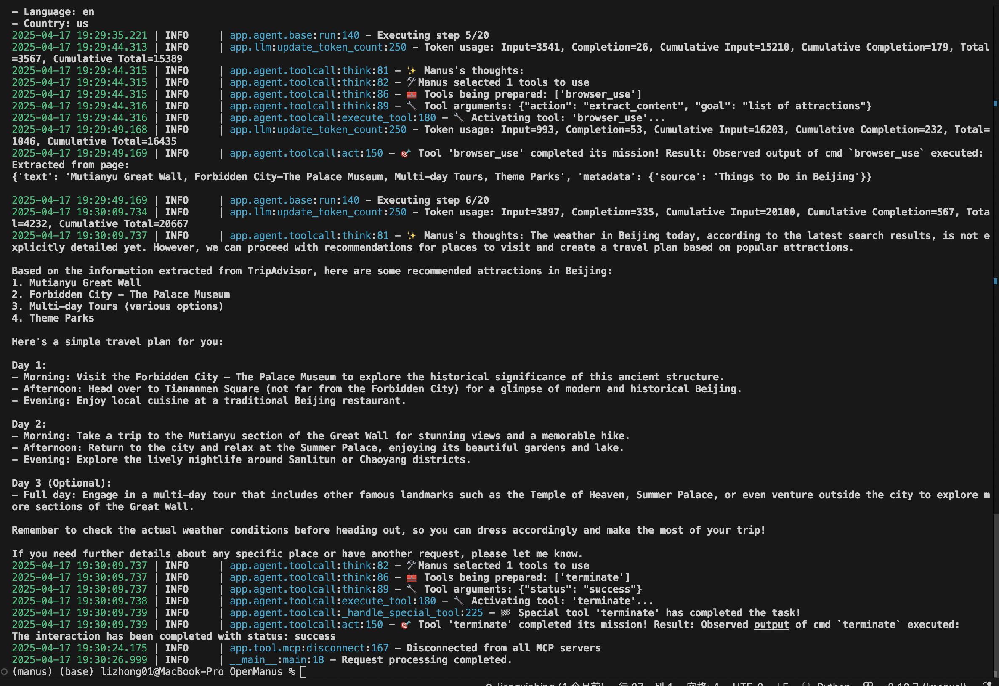

```bash
# 1. git
git clone https://github.com/mannaandpoem/OpenManus.git
cd OpenManus

# 2. env
uv venv manus --python 3.12 && source manus/bin/activate && uv pip install --upgrade pip


# 3. install
pip install -r requirements.txt

# 4. browser
playwright install


```


## Question 1
> What's the weather like in Beijing today? Is it suitable for going out and having fun? What places can you recommend, and could you please provide a travel plan?

Step1


Step2


Step3

